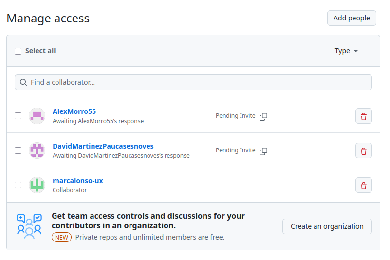
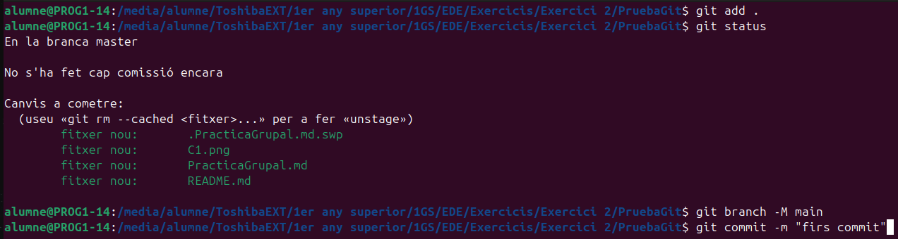

## Práctica Grupal
### Marc Sanchez, Marc Alonso, David M, Alex M
#### Paso 1. Compartir el repositorio remoto con los compañeros

#### Paso 2. Subir estos archivos recién creados al repositorio, haciendo el primer commit

